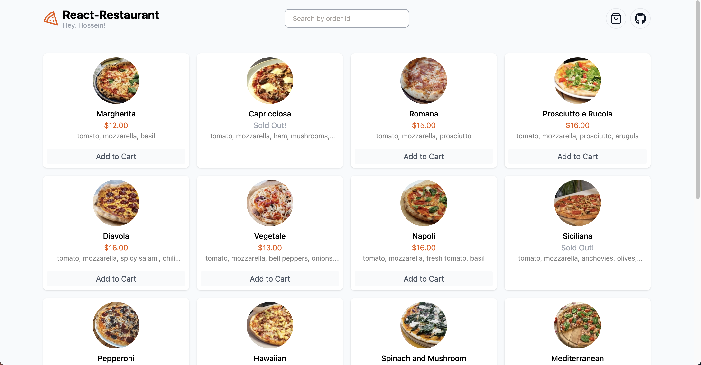

# React Restaurant Online Menu

This repository contains a simple  online menu with  beautiful user interface 🌟 built using React.js.

## Screenshots





## Technologies Used

- React.js
- React Router (+Remote state management)
- Redux
- Tailwind css

  
## Features

- Responsive design
- Listing Menu Items
- Manage Cart
- Submit Order
- Track Order

## Installation

1. Clone the repository:

   ```bash
   git clone https://github.com/M-Aitisam/Resturant-Project.git

2. Navigate to the project directory:
   
   ```bash
   cd react-restaurant-app

3. Install dependencies

    ```bash
    npm install


4. Start the development server
   
    ```bash
    npm run dev

5. Open your browser and visit http://localhost:5173/ to view the app.


## Credits

This Restaurant App is developed by Hossein Amirhosseini.

## License

This project is licensed under the [MIT License](LICENSE).
